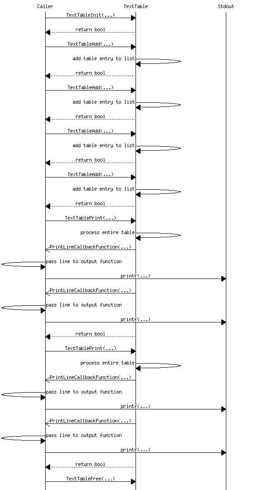
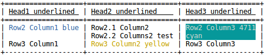

# texttable
With _texttable_ you can easily create tables that use ASCII characters.
Such tables can be used for anything as possible, e.g. system status, debugging, display of measured values and much more.

The implementation is done in **pure C**, there are no additional dependencies only the standard libraries are needed.\
Formatted strings are supported, the table entries can be created with a **printf(...)** similar function.\
In addition, ANSI sequences are supported so that table entries can also be displayed in color.

### Usage example



### Output example

#### Using plain ASCII

Different styles are supported. Here, for the sake of simplicity, only one is shown.
```
  +================+============================+============================+============================+=================+
  | Headline1      | Headline2                  | Headline3                  | Headline4                  | Headline n      |
  +================+============================+============================+============================+=================+
  | Row2 Column1   | Row2 Column2               | Row2 Column3               | Row2 Column4               | Row2 Column n   |
  +----------------+----------------------------+----------------------------+----------------------------+-----------------+
  | Row3.1 Column1 | Row3.1 Column2             | Row3.1 Column3 'some text' | Row3.1 Column4 int: '4711' | Row3.1 Column n |
  |                | Row3.2 Column2 'some text' |                            |                            |                 |
  |                | Row3.n Column2 ...         |                            |                            |                 |
  +----------------+----------------------------+----------------------------+----------------------------+-----------------+
  | Row n Column1  | Row n Column2              | Row n Column3              | Row n Column4              | Row n Column n  |
  +----------------+----------------------------+----------------------------+----------------------------+-----------------+
```

#### Using ANSI sequences

Shows the output on a Linux terminal.


